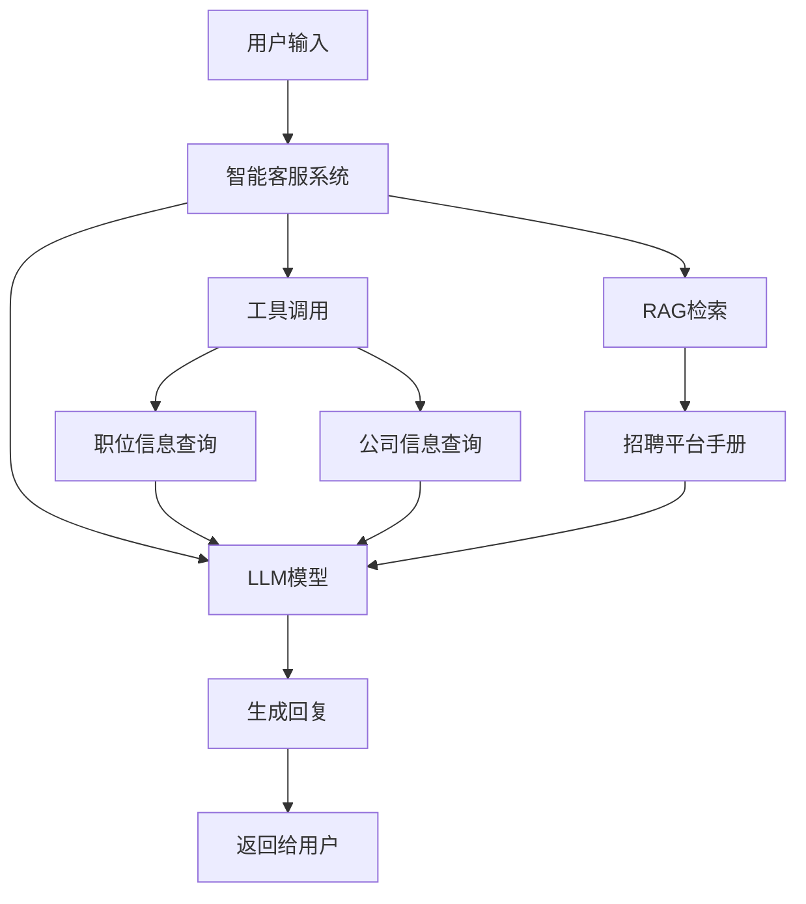

***

## 智能客服系统

## 项目概述

本项目使用LangChain框架搭建了一个智能客服系统，专门用于招聘平台场景。系统集成了多种高级特性，包括大语言模型(LLM)、函数工具(Function Tool)、检索增强生成(RAG)等，为用户提供专业、准确的招聘相关信息和服务。

### 项目目标

- 构建一个基于LangChain的智能客服系统
- 集成多种高级特性，包括LLM、Function Tool、RAG等
- 适应招聘平台场景，提供专业的招聘相关服务
- 实现智能问答、信息检索、工具调用等功能

## 技术栈分析

| 技术/框架                  | 版本      | 用途                  | 来源    |
| ---------------------- | ------- | ------------------- | ----- |
| Python                 | 3.12    | 编程语言                | 系统环境  |
| LangChain              | 1.2.13  | 构建LLM应用的框架          | pip安装 |
| LangChain Community    | 0.4.1   | 提供社区集成的组件           | pip安装 |
| DashScope              | 1.25.15 | 调用通义千问模型            | pip安装 |
| Chroma                 | 1.5.5   | 向量存储库               | pip安装 |
| HuggingFace Embeddings | -       | 文本嵌入模型              | pip安装 |
| Sentence-Transformers  | 5.3.0   | sentence embeddings | pip安装 |

## 项目流程

### 系统架构

### 核心流程

1.